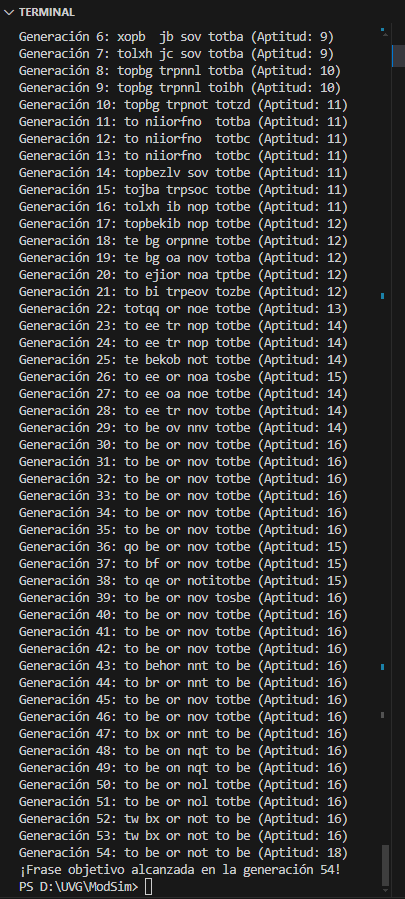
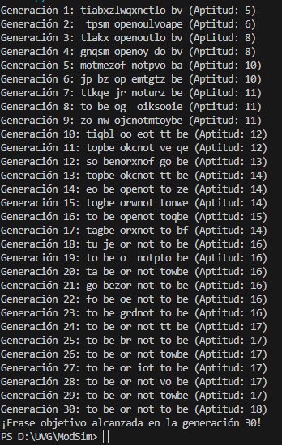
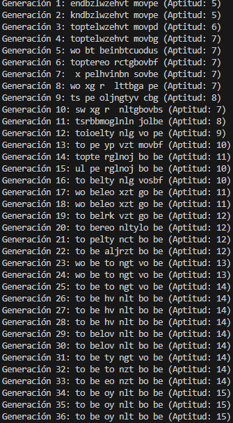
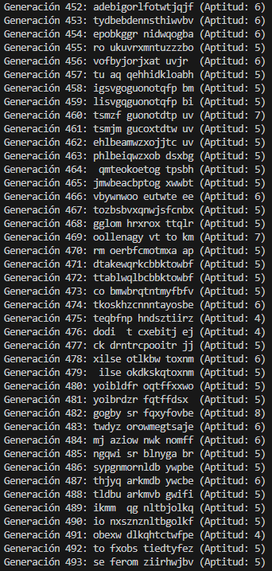
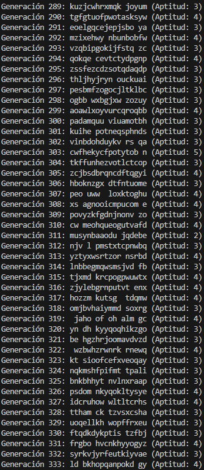

Alejandro Martinez - 21430

## Configuración Inicial:
Define la frase objetivo que el algoritmo debe generar.
```python
TARGET_PHRASE = "to be or not to be"
POPULATION_SIZE = 200
MUTATION_RATE = 0.01
ALPHABET = "abcdefghijklmnopqrstuvwxyz "
```
## Establece el tamaño máximo de la población.
Configura la tasa de mutación como un porcentaje (0-100%) para controlar la diversidad genética.
Inicialización de la Población:
Genera una población inicial de secuencias de caracteres de igual longitud que la frase objetivo.
Cada secuencia debe ser creada de manera aleatoria utilizando letras del alfabeto y espacios.
```python
population: List[str] = [random_string(len(TARGET_PHRASE)) for i in range(POPULATION_SIZE)]

generation = 0
best_individual = ''
best_fitness = 0
```
## Ejecución del Algoritmo:
Implementa el ciclo principal del algoritmo genético, que incluye las siguientes etapas:
### Selección: Evalúa y selecciona individuos de la población en función de su similitud a la frase objetivo.
```python
def selection(population: List[str], fitnesses: List[int]):
	total_fitness = sum(fitnesses)
	pick = random.uniform(0, total_fitness)
	current = 0
	for individual, fit in zip(population, fitnesses):
		current += fit
		if current > pick:
			return individual
```
### Reproducción: Combina pares de individuos seleccionados para crear descendencia.
```python
def crossover(parent1: str, parent2: str):
	crossover_point = random.randint(0, len(parent1) - 1)
	child = parent1[:crossover_point] + parent2[crossover_point:]
	return child
```
### Mutación: Aplica la tasa de mutación para introducir pequeños cambios aleatorios en los genes de algunos individuos.
```python
def mutate(individual: str):
	mutated = ''.join(
		(char if random.random() > MUTATION_RATE else random.choice(ALPHABET))
		for char in individual
	)
	return mutated
```
### Sustitución: Reemplaza la población anterior con la nueva generación creada.
```python
population = new_population
```
## Convergencia:
Monitorea la población en cada generación para verificar si alguna secuencia ha alcanzado la frase objetivo.
Registra el número de generaciones necesarias para lograr la convergencia.
```python
population = new_population
best_individual = max(population, key=fitness)
best_fitness = fitness(best_individual)
```
## Visualización:
Implementa una función de visualización que muestre el progreso de la población en cada generación.
Esto puede incluir la impresión de la secuencia más apta en cada generación.
```python
print(f"Generación {generation}: {best_individual} (Aptitud: {best_fitness})")
```

# Incluir el número de generaciones requeridas para converger en la frase objetivo.
55
```python
POPULATION_SIZE = 200
MUTATION_RATE = 0.01
```

# Incluir las características de las funciones de Selección, Reproducción y Mutación.
### Selección
```python
def selection(population: List[str], fitnesses: List[int]):
	total_fitness = sum(fitnesses)
	pick = random.uniform(0, total_fitness)
	current = 0
	for individual, fit in zip(population, fitnesses):
		current += fit
		if current > pick:
			return individual
```
Evalúa y va selecciononando las cadenas/individuos de la población dependiendo de la similitud que tenga con el target.
### Reproducción:
```python
def crossover(parent1: str, parent2: str):
	crossover_point = random.randint(0, len(parent1) - 1)
	child = parent1[:crossover_point] + parent2[crossover_point:]
	return child
```
Es la union de ambas cadenas, el primer padre se corta en un porcentaje aleatorio y el segundo padre la otra parte restante. El hijo esta compuesto por un porcentaje aleatorio de el valor de un padre y la otra parte el valor del otro.
### Mutación
```python
def mutate(individual: str):
	mutated = ''.join(
		(char if random.random() > MUTATION_RATE else random.choice(ALPHABET))
		for char in individual
	)
	return mutated
```
Introduce un valor aleatorio dentro de la cadena dependiendo del valor de mutacion como threshold. Esto ayuda a la "evolución" y generacion de variantes nuevas.
# ¿Qué sucede si el tamaño máximo de la población es demasiado bajo?
La ejecución es muy rápida pero dado que las opciones/población de la cual puede seleccionar son muy limitadas es probable que se tome demasiado tiempo o se quede generando palabras aleatorias y nunca "evolucione".
```python
POPULATION_SIZE = 5
```
# ¿Qué ocurre si el tamaño máximo de la población es demasiado alto?
La ejecucuión se volverá más lenta, y por el tamaño del set de datos (una oracion corta), no habrá mucho beneficio en cuanto a mejroas en la cantidad de generaciones necesarias.
```python
POPULATION_SIZE = 10000
```

# ¿Qué sucede si la tasa de mutación es del 0%?
Inicialmente no hay mucha diferencia pero las generaciones cercanas al resultado no van a mutar y será muy dificil que convergan en la respuesta correcta. (Se queda en aptitud 14-15)
```python
MUTATION_RATE = 0
```

# ¿Qué pasa si la tasa de mutación es del 50%?
(Se queda en aptitud 5-6)
Los valores internos se mutan casi siempre por lo que hay demasiada aleatoriedad y no puede mantenerse en curso a llegar a la frase objetivo, es posible con una poblacion mas alta probablemente pero es una tasa de reemplazo aleatorio demasiado alta para que la frase cambie nuevamente a algo aleatorio con cada generacion.
```python
MUTATION_RATE = 0.2
```

# ¿Qué ocurre si la tasa de mutación es del 100%?
(Se queda en aptitud 3-4)
Los valores internos se mutan siempre por lo que hay demasiada aleatoriedad y no puede mantenerse en curso a llegar a la frase objetivo.
```python
MUTATION_RATE = 1.0
```
